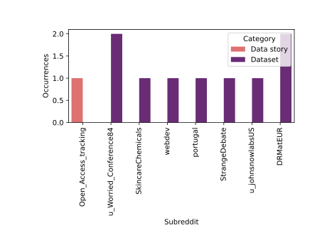

# dataeuropa-analysis
Repository for the analysis of data.europa.eu done in task 3.4


## StackOverFlow

```
python -m datacoll.stackoverflow
```

## Reddit


 
```
python -m datacoll.reddit
```
## Github


```
python -m datacoll.github code
```


```
python -m datacoll.github commits
```


```
python -m datacoll.github repositories
```


Distribution of data.europe.eu resources across Github sources.