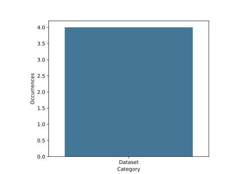
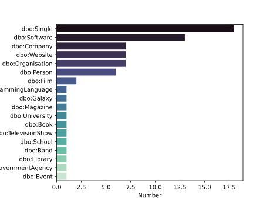
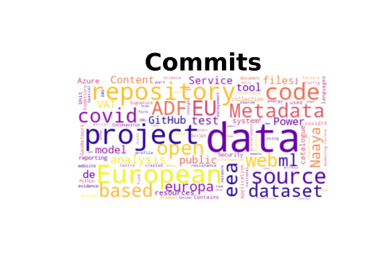
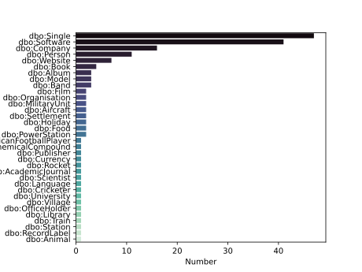
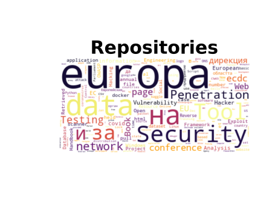
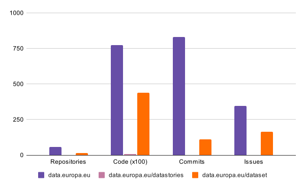

# DataEuropa Analysis

Public organisations are publishing their datasets in data.europa.eu. Several studies are conducted to measure the reuse of these datasets. The aim of this repository is to understand the context in which these datasets are mentioned and analyse the reuse of these datasets from other platforms, such as StackOverflow, Reddit, and GitHub.

[//]: # (Repository for the analysis of data.europa.eu done in task 3.4)


## Table of Content
1. [Data Collection](#data-collection) 
2. [Analysis](#analysis)
3. [Experimentation](#experimentation)
3. [Results](#results)
4. [Tests](#tests)
5. [Contributors](#contributors)


## Data Collection
In this process, the data (e.g., posts) containing the link data.europa.eu is downloaded and stored. The format is different for each platform. There is a data collection module for each platform to fetch and prepare the data for the analysis phase. 


## Analysis
The analysis phase is platform agnostic. The different data collection module will call the different analysis function. 

The analysis is composed of the following:
* **Datasets .vs Datastories.**
* **Dataset Topical Analysis.**
* **Context Topical Analysis.**
* **Context Keywords.**

There is also some additional analyses that is only feasible for certain platforms (platform-specific analysis).
* Topical analysis using tags.
* Dataset/Datastory per sub-reddit.


## Experimentation
To ease the experimentation, will the data collection and analyses will be executed in a single command (for each platform). If the data is already downloaded, then the analysis will use the downloaded version. 

#### StackOverflow
```
python -m datacoll.stackoverflow
```

#### Reddit
```
python -m datacoll.reddit
```


#### GitHub
GitHub analysis is performed on the code, commits, and repositories. 
##### Code
```
python -m datacoll.github code
```
##### Commits
```
python -m datacoll.github commits
```
##### Repositories
```
python -m datacoll.github repositories
```


## Results


### StackOverFlow





Because "&#39" actually refers to `'`. 

### Reddit


 


#### Dataset per EDP Category
 

[//]: # (### Collect the data and run the analytics for Reddit)

[//]: # (This will collect the data from reddit as json and store them if they are not collected yet and)

[//]: # (then runs the analytics. This will also generate the different diagrams as well.)


## GitHub
### Code




### Commits




### Repositories



### Distribution of data.europe.eu resources across Github sources



## Tests
To run the tests
```
python -m unittest tests
```

## MISC
To compare the results from algorithm 1 (using the `body` parameter) vs algorithm 2 (using the `q` parameter)
```
python -m misc.stackoverflow_search_algorithms
```

## Contributors
* [Ahmad Alobaid](https://github.com/ahmad88me)
* [Elvira Amador-Domínguez](https://github.com/eamadord)
* [Oscar Corcho](https://github.com/ocorcho)