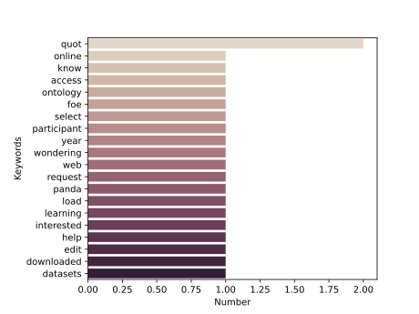
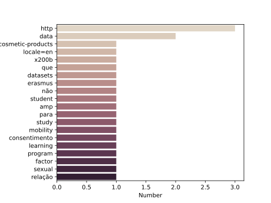

# DataEuropa Analysis

Public organisations are publishing their datasets in data.europa.eu. Several studies have been conducted to measure the reuse of these datasets. The aim is to measure the presence of data.europa.eu in external platforms, understand the context in which these datasets are mentioned and analyse the presence of these datasets in these platforms, such as StackOverflow, Reddit, and GitHub.


[//]: # (Repository for the analysis of data.europa.eu done in task 3.4)


## Table of Content
1. [Data Collection](#data-collection) 
2. [Analysis](#analysis)
3. [Experimentation](#experimentation)
3. [Results](#results)
4. [Evolution](#evolution)
4. [Tests](#tests)
5. [Contributors](#contributors)


## Data Collection
In this process, the data (e.g., posts) containing the link data.europa.eu is downloaded and stored. The format is different for each platform. There is a data collection module for each platform to fetch and prepare the data for the analysis phase. 


## Analysis
The analysis phase is platform agnostic. The different data collection modules will call the analysis functions. 


The analysis is composed of the following:
* **Datasets .vs Datastories.**
* **Dataset Topical Analysis.**
* **Context Topical Analysis.**
* **Context Keywords.**

There are also some additional analyses that are only feasible for certain platforms (platform-specific analysis).

* Topical analysis using tagsv (StackOverflow).
* Dataset/Datastory per sub-reddit (Reddit).


## Experimentation
To ease the experimentation, the data collection and analyses will be executed in a single command (for each platform). If the data is already downloaded, then the analysis will use the downloaded version. 

#### StackOverflow
```
python -m datacoll.stackoverflow
```

#### Reddit
```
python -m datacoll.reddit
```


#### GitHub
GitHub analysis is performed on the code, commits, and repositories. 
##### Code
```
python -m datacoll.github code
```
##### Commits
```
python -m datacoll.github commits
```
##### Repositories
```
python -m datacoll.github repositories
```


## Results


### StackOverFlow




[//]: # (![]&#40;stackoverflow_tags.svg&#41;)

[//]: # (![]&#40;stackoverflow_datasets_cats.svg&#41;)

[//]: # (![]&#40;stackoverflow_cat.svg&#41;)

[//]: # (![]&#40;stackoverflow_keywords.svg&#41;)


Because "&#39" actually refers to `'`. 

### Reddit




[//]: # (![]&#40;reddit_cat.svg&#41;)

[//]: # (![]&#40;reddit_cat_per_sub.svg&#41;)

[//]: # (![]&#40;reddit_class.svg&#41; )

[//]: # (![]&#40;reddit_keywords.svg&#41;)

#### Dataset per EDP Category


[//]: # (![]&#40;reddit_datasets_cats.svg&#41; )

[//]: # (### Collect the data and run the analytics for Reddit)

[//]: # (This will collect the data from reddit as json and store them if they are not collected yet and)

[//]: # (then runs the analytics. This will also generate the different diagrams as well.)


## GitHub
### Code


[//]: # (![]&#40;github_code.svg&#41;)

[//]: # (![]&#40;github_code_class.svg&#41;)


### Commits


[//]: # (![]&#40;github_commits.svg&#41;)

[//]: # (![]&#40;github_commits_class.svg&#41;)


### Repositories


[//]: # (![]&#40;github_repositories.svg&#41;)

[//]: # (![]&#40;github_repositories_class.svg&#41;)

### Distribution of data.europe.eu resources across Github sources


[//]: # (![]&#40;data_europe_distribution.svg&#41;)


## Evolution
The results of these analyses are expected to change over time. Hence, the new version of the date would need to be downloaded. Without any change in the code, copy the content of the data folder somewhere else and then delete the JSON files. Note that the data collection from GitHub would take much more time to process.

### Steps to download a new version of the data
1. Copy the old data somewhere.
2. Delete the json files.
3. Run the data collection command (see [Data Collection](#data-collection)). *Note that for GitHub it might take much more time and there is also there is a limit on the API usage.*


## Tests
To run the tests
```
python -m unittest tests
```

## MISC
### Comparing StackOverflow search algorithms
To compare the results from algorithm 1 (using the `body` parameter) vs algorithm 2 (using the `q` parameter)
```
python -m misc.stackoverflow_search_algorithms
```


## Contributors
* [Ahmad Alobaid](https://github.com/ahmad88me)
* [Elvira Amador-Domínguez](https://github.com/eamadord)
* [Oscar Corcho](https://github.com/ocorcho)