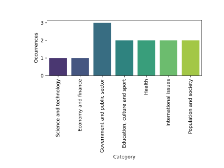
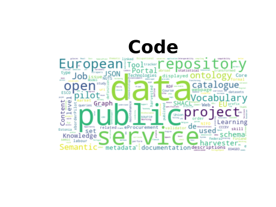

# dataeuropa-analysis
Repository for the analysis of data.europa.eu done in task 3.4


## StackOverFlow

```
python -m datacoll.stackoverflow
```

## Reddit


 
#### Dataset per EDP Category
 
```
python -m datacoll.reddit
```
## Github
### Code



```
python -m datacoll.github code
```

### Commits


```
python -m datacoll.github commits
```


### Repositories


```
python -m datacoll.github repositories
```
### Distribution of data.europe.eu resources across Github sources


# Tests
To run the tests
```
python -m unittest tests
```